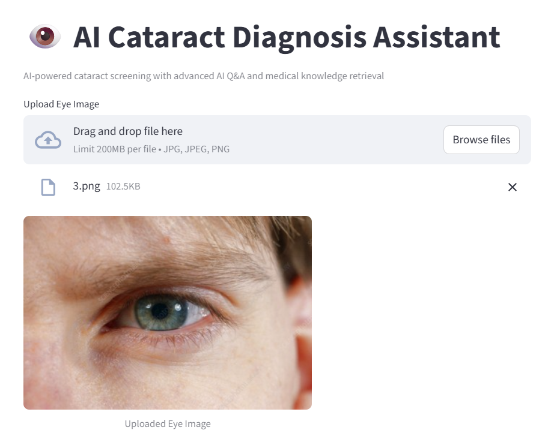
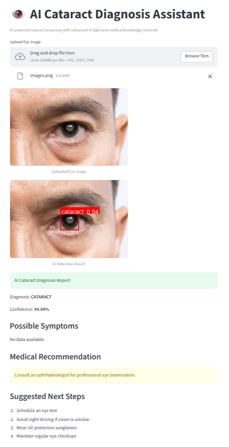
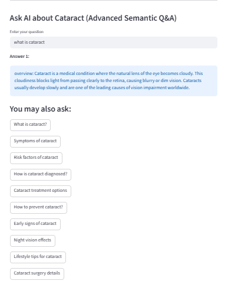

# 👁️ AI Cataract Diagnosis Assistant

[](https://www.python.org/)
[](https://streamlit.io/)
[]()
[]()

> 🚀 **AI-powered cataract detection assistant** combining **YOLOv8 deep learning** with a **semantic search pipeline inspired by Endee vector database** for intelligent medical Q&A.

---

## 🎯 Project Overview

The **AI Cataract Diagnosis Assistant** is an end-to-end AI application designed for:

- 👁️ Early cataract screening  
- 🧠 AI-powered medical Q&A  
- 🏥 Patient awareness & education  
- 💡 Telemedicine support  

Users can upload eye images, receive AI-based diagnosis, and ask natural language questions about cataracts.

---

## ✨ Key Features

### 🔍 Cataract Detection
- Upload eye images (JPG, PNG, JPEG)
- Detect **Cataract vs Normal**
- Confidence score prediction
- Bounding box visualization

### 🧠 Semantic Medical Q&A
- Ask medical questions in natural language
- Context-aware answers using semantic similarity

### 📊 Visual Feedback
- Annotated images with bounding boxes
- Clean and simple UI

### 💡 Medical Guidance
- Suggested next steps
- Easy-to-understand explanations

### 🛡️ Fallback Knowledge System
- Local medical data backup
- Ensures reliable answers

---
## 🏗️ System Architecture

```
User Input (Image / Question)
        ↓
Streamlit Frontend
        ↓
 ┌──────────────────────┬──────────────────────────┐
 │ YOLOv8 Model         │ Semantic Search Engine   │
 │ (Image Detection)    │ (Embeddings + Similarity)│
 └──────────────────────┴──────────────────────────┘
        ↓
Diagnosis + AI Response + Recommendations
```
## 🧠 Semantic Search (Endee-Inspired)

This project implements a **semantic retrieval pipeline inspired by Endee vector database architecture**:

### Workflow:
1. Medical knowledge → converted into embeddings  
2. Query → converted into embedding  
3. Cosine similarity → finds best match  
4. Relevant answer returned  

👉 Simulates **RAG (Retrieval-Augmented Generation)** systems

---

## 🛠️ Technology Stack

| Category | Tools |
|--------|------|
| Language | Python 3.10+ |
| UI | Streamlit |
| AI Model | YOLOv8 |
| NLP | Sentence Transformers |
| Search | Cosine Similarity |
| Libraries | NumPy, Scikit-learn, Pillow |

---
## 📂 Project Structure

```
cataract-assistant/
│
├── app.py
├── model_utils.py
├── endee_setup.py
├── medical_data.txt
├── requirements.txt
├── README.md
├── temp/
└── docs/
```

---

## ⚡ Installation & Setup

```bash
# Clone repository
git clone https://github.com/YOUR_USERNAME/cataract-assistant.git
cd cataract-assistant

# Create virtual environment
python -m venv venv

# Activate
venv\Scripts\activate
# or
source venv/bin/activate

# Install dependencies
pip install -r requirements.txt

# Run app
streamlit run app.py
```


## 📸 Demo

### 🔹 Upload Interface


### 🔹 Detection Result


### 🔹 AI Q&A Interface


## 🧪 Use Cases

- 🏥 Early cataract screening in rural areas  
- 📱 Telemedicine and remote diagnosis  
- 🎓 Medical student training and education  
- 🤖 AI-powered healthcare assistants  
